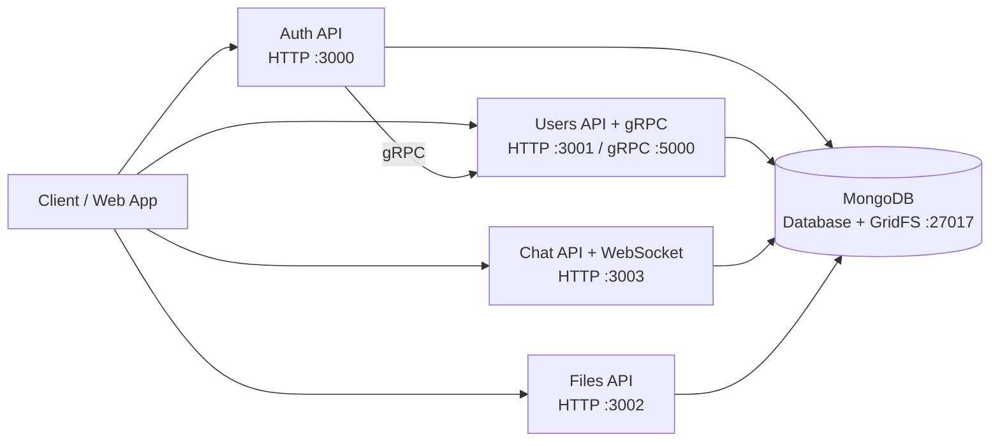
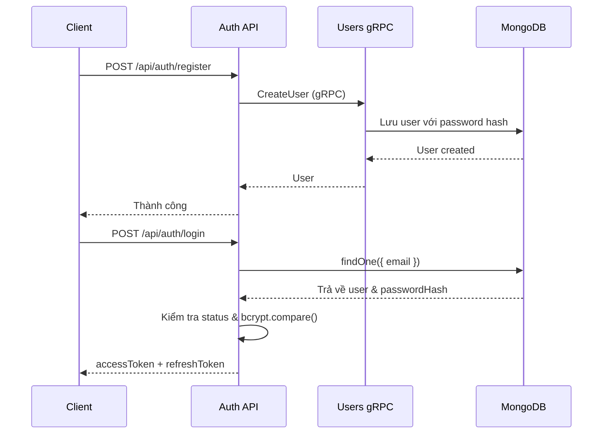
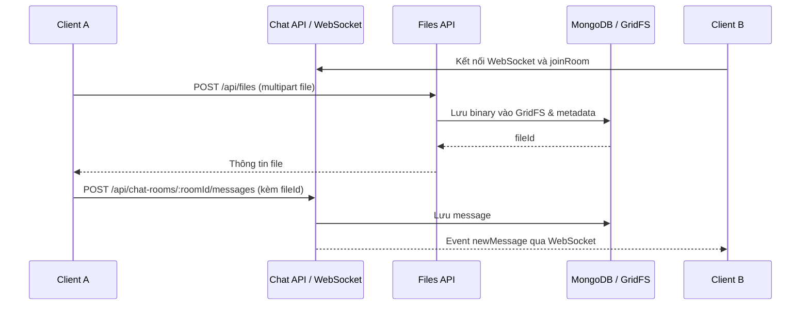

Nền tảng chia sẻ tệp và nhắn tin thời gian thực toàn diện, quản lý bằng Nx monorepo:

- **Frontend (`my-app`):** Giao diện người dùng web client.
- **Backend Microservices:** Các service NestJS chuyên biệt (`auth`, `users`, `files`, `chat`) kết hợp HTTP, gRPC, Socket.IO và MongoDB/GridFS.

## 1. Khởi động nhanh

### Bước 1: Clone và cài dependencies

```bash
npm install
```

### Bước 2: Tạo biến môi trường

Tạo file `.env` ở thư mục gốc:

```env
MONGODB_URI=mongodb://127.0.0.1:27017/realtime_file_sharing
JWT_SECRET=replace-with-a-long-random-secret
USERS_GRPC_URL=127.0.0.1:5000
```

### Bước 3: Khởi động MongoDB

```bash
docker compose -f .development/docker-compose.yml up -d
```

### Bước 4: Chạy các service

Chạy tất cả service trong các process do Nx quản lý:

```bash
npm run start:dev
```

Hoặc chạy riêng từng service:

**Frontend**

```bash
npx nx serve my-app
```

**Backend**

```bash
npx nx serve auth
npx nx serve users
npx nx serve files
npx nx serve chat
```

## 2. Kiến trúc



### Luồng đăng ký và đăng nhập



### Luồng chat và chia sẻ tệp



## 3. Cấu trúc thư mục

```text
apps/
  auth/      # Đăng ký, đăng nhập, JWT và client gRPC tới users
  users/     # Quản lý user qua HTTP và gRPC
  chat/      # Phòng chat, message và Socket.IO gateway
  my-app/     # Ứng dụng web frontend (React)
  files/     # Upload, download và share link qua GridFS
libs/
  common/    # MongoDB, JWT strategy, guard và decorator dùng chung
  models/    # Mongoose schema và DTO dùng chung
  smc/gridfs # Cấu hình Multer GridFS
.development/
  docker-compose.yml # MongoDB cho môi trường development
```
